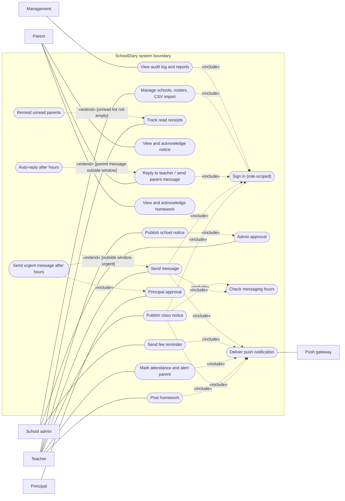
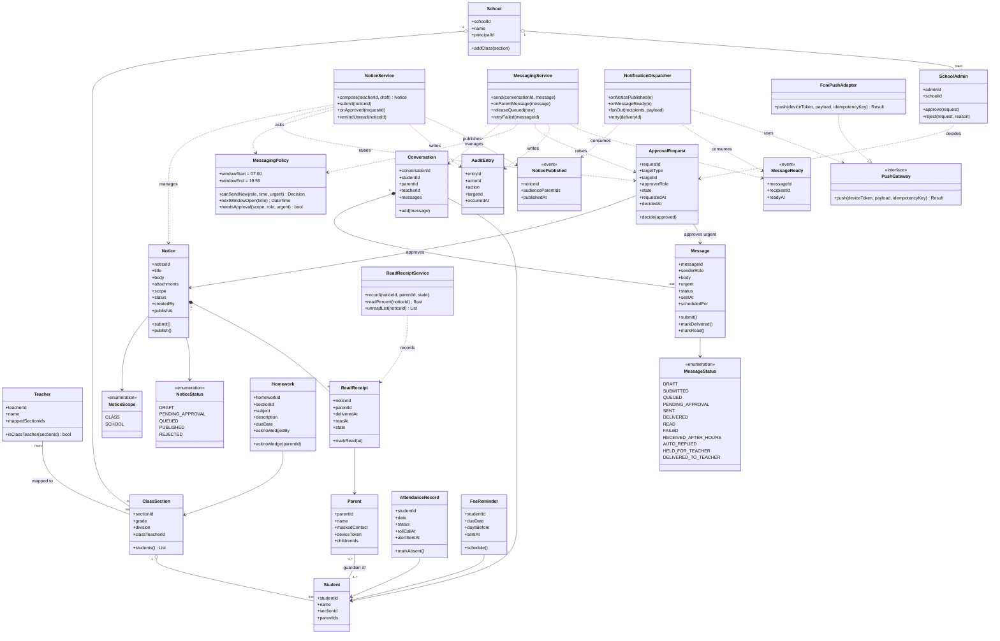
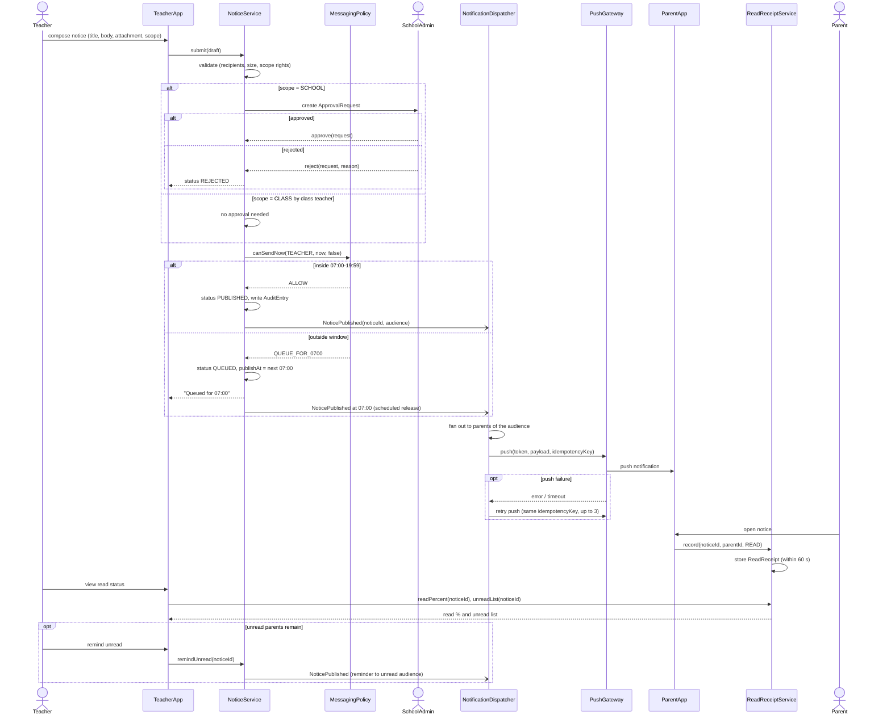
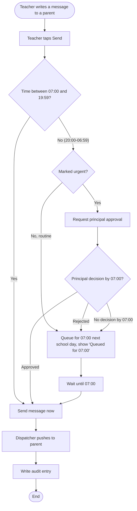
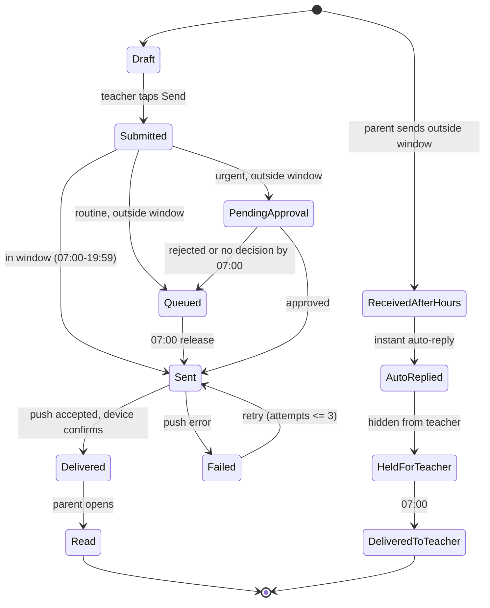
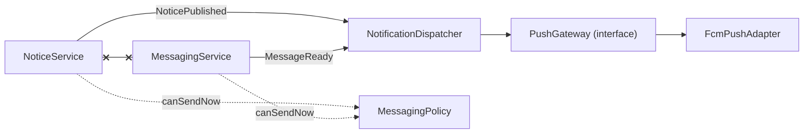

# Design Specification (UML Package) — SchoolDiary

These models cover the requirements in [the SRS](01_SRS_and_Priorities.md) (FR-01 to FR-10, NFR-01 to NFR-06). They are logical design views, not implementation claims. All diagrams use the same terms: parent, teacher, school admin, principal, notice, message, messaging window, approval request, event, dispatcher and audit entry. The package holds a use-case diagram, a class diagram, a sequence diagram, an activity diagram and a message state diagram. Section 7 checks that they agree with one another.

**Rule set used throughout (SRS FR-08).** All times are IST, at minute granularity. The teacher sending window is 07:00-19:59 inclusive. A routine teacher message outside the window is queued for 07:00 the next school day. An urgent teacher message outside the window needs principal approval; approved means sent now, while rejected or no decision by 07:00 means sent at 07:00. Parents may send at any time; the teacher sees the message at 07:00 and the parent gets an instant auto-reply. A class-level notice by the class teacher publishes immediately (inside the window), and a school-level notice always needs school-admin approval.

## 1. Use-case model

Actors sit outside the system boundary. «include» and «extend» are drawn as labelled dashed edges. The Push gateway is a secondary (external system) actor.

Notes: Send message includes Check messaging hours because every teacher message passes the rule. Send urgent message after hours extends Send message only when the message is outside the window and marked urgent; the base use case is complete without it. Publish school notice includes Admin approval because a school-level notice can never skip approval (FR-02). Remind unread parents extends Track read receipts only when the unread list is not empty. Send fee reminder is triggered by the school admin's fee records; no payment use case exists (out of scope).

## 2. Class model

Relationship rule: **NoticeService and MessagingService have no association, dependency or call between them.** Each publishes its own event; only NotificationDispatcher consumes the events and only it talks to PushGateway.

Design notes:
- Homework, attendance and fee reminders also publish events to the same dispatcher (same pattern as NoticePublished). They are omitted from the diagram to keep it readable.
- `MessagingPolicy.canSendNow(role, time, urgent)` returns one of ALLOW, QUEUE_FOR_0700 or NEEDS_PRINCIPAL_APPROVAL. For a parent it always returns ALLOW.
- `FcmPushAdapter` is one adapter; swapping the push vendor changes only that class (NFR-01, NFR-06).
- Phone numbers are held as `maskedContact` in anything a teacher can read (NFR-04).

## 3. Sequence diagram: send a notice and track read receipts

Scenario: a teacher sends a school-level notice. Approval by the school admin and the time-window check both appear as `alt` blocks. `TeacherApp` and `ParentApp` are UI clients, not domain classes.

Every class or component in the diagram exists in section 2, except `TeacherApp` and `ParentApp` (clients) and the three human actors (Teacher, SchoolAdmin, Parent; these map to the classes Teacher, SchoolAdmin and Parent). See section 7.

## 4. Activity diagram: teacher sends a message

This mirrors the rules exactly: 07:00-19:59 sends immediately; a routine message outside the window is queued; an urgent message outside the window goes to the principal, and approval sends now while rejection or silence means 07:00. Approved urgent messages are counted separately in the after-8 p.m. report.

## 5. State diagram: message

The teacher-to-parent branch is on the left, the parent-to-teacher branch on the right. The state names are the values of `Message.status` (class diagram).

A parent message sent inside the window skips the right-hand branch and follows the same Sent, Delivered, Read path as a teacher message. A Failed message that exhausts three retries stays Failed and is listed for the school admin (a terminal state at the report level, with the audit entry retained).

## 6. Cohesion and coupling

### 6.1 Modules

| Module | Single responsibility | Depends on |
|---|---|---|
| Accounts/Admin | Roles, schools, classes, rosters, teacher-class mapping, CSV import, approval queue (FR-01, FR-09) | Audit/Reports (writes entries) |
| Notices | Compose, approve, schedule and publish notices (FR-02) | Policy/Hours, Accounts/Admin (roles, approvals), Audit/Reports; emits NoticePublished |
| ReadReceipts | Record delivered/read per parent; compute read % and unread list (FR-03) | Notices (notice id and audience, by id only) |
| Homework | Post homework per class/subject with due date and acknowledgement (FR-04) | Accounts/Admin (class rosters); emits an event to Dispatcher |
| Attendance | Turn an absent mark into a parent alert within 15 min of roll call (FR-05) | Accounts/Admin (rosters); emits an event to Dispatcher |
| FeeReminders | Schedule reminders at 7 days and 1 day before due date from fee records; no payment (FR-06) | Accounts/Admin (student-parent records); emits an event to Dispatcher |
| Messaging | Threads per student, send/queue/approve, parent after-hours hold and auto-reply (FR-07) | Policy/Hours, Audit/Reports; emits MessageReady |
| Policy/Hours | Own the 07:00-19:59 window and the approval rules; answer `canSendNow` (FR-08) | Nothing (pure rules, no I/O) |
| Dispatcher | Consume events, fan out, call PushGateway, retry, idempotency (NFR-01, NFR-02) | PushGateway interface only |
| Audit/Reports | Searchable communication record; monthly-active-parents and after-8 p.m. reports (FR-10) | Reads entries from the other modules (no calls back) |

Each module has one reason to change: a new window time changes only Policy/Hours; a new push vendor changes only the adapter under Dispatcher; a new notice type changes only Notices. Cohesion is functional in every row: everything inside a module serves its one responsibility.

### 6.2 How messaging and notices stay loosely coupled

Notices and Messaging are the two biggest features, and they change for different reasons: notices follow school administration, messaging follows the hours rule. So neither module knows the other exists. NoticeService publishes a `NoticePublished` event and MessagingService publishes a `MessageReady` event. Both are consumed by one shared NotificationDispatcher, which owns fan-out, retries and the PushGateway adapter. The two services share only the Policy/Hours module, which is a pure function of role, time and urgency; it is reused, not duplicated, so the notice queue and the message queue always obey the same 07:00-19:59 window and cannot drift apart.

Consequences. First, a change to the messaging rule (for example a different end time) is made once in MessagingPolicy and applies to both. Second, a defect in messaging cannot break notice publishing, and either can be tested with a stub dispatcher. Third, delivery reliability (NFR-01, NFR-02) is tested once, at the dispatcher, using idempotency keys. Fourth, the price is indirection: an event bus and asynchronous delivery make tracing harder, so the Audit module records every event with an id. The coupling type is data coupling through events, the weakest useful form.

The crossed link between NoticeService and MessagingService marks the absence of any dependency.

## 7. Consistency check

### 7.1 Sequence diagram elements against the class diagram

| Sequence participant | Class in section 2 | Result |
|---|---|---|
| Teacher (actor) | Teacher | Present |
| TeacherApp / ParentApp | UI clients (no domain class; call the services only) | Boundary, not modelled |
| NoticeService | NoticeService | Present |
| MessagingPolicy | MessagingPolicy (`canSendNow`) | Present |
| SchoolAdmin (actor) | SchoolAdmin (`approve`, `reject`) | Present |
| ApprovalRequest | ApprovalRequest | Present |
| NoticePublished | NoticePublished (event) | Present |
| NotificationDispatcher | NotificationDispatcher | Present |
| PushGateway | PushGateway (interface) with FcmPushAdapter | Present |
| ReadReceiptService | ReadReceiptService (`record`, `readPercent`, `unreadList`) | Present |
| ReadReceipt | ReadReceipt | Present |
| Parent (actor) | Parent | Present |

MessagingService does not appear in the sequence diagram and NoticeService never calls it; this agrees with the class diagram.

### 7.2 States against `Message.status`

| State diagram state | In MessageStatus enum | Use case / rule |
|---|---|---|
| Draft | DRAFT | Send message |
| Submitted | SUBMITTED | Check messaging hours |
| Queued | QUEUED | Routine after hours; rejected or no decision |
| PendingApproval | PENDING_APPROVAL | Send urgent message after hours; Principal approval |
| Sent | SENT | Deliver push notification |
| Delivered | DELIVERED | Deliver push notification |
| Read | READ | Parent opens message |
| Failed | FAILED | Retry up to 3 |
| ReceivedAfterHours | RECEIVED_AFTER_HOURS | Reply to teacher / send parent message |
| AutoReplied | AUTO_REPLIED | Auto-reply after hours |
| HeldForTeacher | HELD_FOR_TEACHER | Parent hold rule |
| DeliveredToTeacher | DELIVERED_TO_TEACHER | 07:00 release |

All 12 states appear in the enum and all 12 enum values appear in the state diagram. The activity diagram uses the same decisions (window, urgent, principal decision) as the transitions out of Submitted and PendingApproval. The use-case diagram includes Check messaging hours, Send urgent message after hours and Principal approval, which correspond to the same rule set. The Notice status values (DRAFT, PENDING_APPROVAL, QUEUED, PUBLISHED, REJECTED) follow the same queueing rule as the message states.
