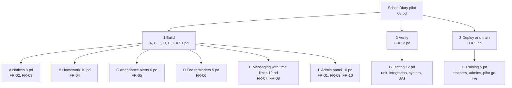
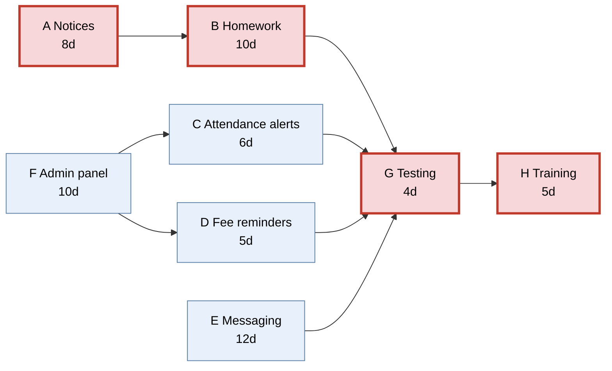
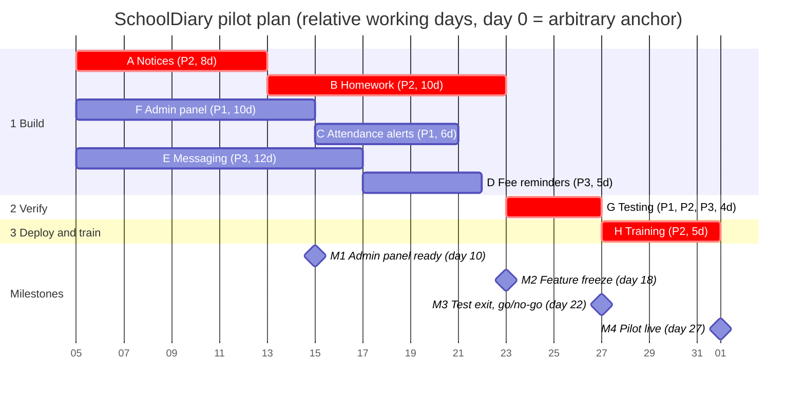

# Project Plan — SchoolDiary (Case 111)

Student: Kishan Ojha. Subject: Software Engineering and Project Management.

## 1. Planning basis

The pilot covers 2 schools (2,300 parents, about 107 teachers) and is built by a team of 3. The eight work items and their person-day efforts come from the case: Notices 8, Homework 10, Attendance alerts 6, Fee reminders 5, Messaging with time limits 12, Admin panel 10, Testing 12, Training 5, giving **68 person-days** (see `04_Estimation_Sheet.md`). Durations are working days; day 0 is project start. No calendar dates, holidays or leave are given, so the plan is an elapsed working-day plan, not a committed calendar date. The dependencies below are my stated assumptions, each justified.

## 2. Work Breakdown Structure (WBS)

| WBS | Work package | Effort (pd) | Deliverable |
|---|---|---:|---|
| 1 | **Build** | 51 | Working pilot software |
| 1.1 | A Notices | 8 | Class and school notices, approval flow, read receipts |
| 1.2 | B Homework | 10 | Homework posting, due dates, parent acknowledgement |
| 1.3 | C Attendance alerts | 6 | Absence alert to parent within 15 min of roll call |
| 1.4 | D Fee reminders | 5 | Reminders at 7 days and 1 day before due date (no payment) |
| 1.5 | E Messaging with time limits | 12 | Parent-teacher threads, 07:00–19:59 sending window, queueing and principal approval |
| 1.6 | F Admin panel | 10 | Schools, classes, rosters, teacher-class mapping, CSV import, approval queue, reports |
| 2 | **Verify** | 12 | Verified release |
| 2.1 | G Testing | 12 | Test log, defect log, test exit report (go/no-go) |
| 3 | **Deploy and train** | 5 | Live pilot |
| 3.1 | H Training | 5 | Trained teachers and admins at 2 schools, pilot live |
| | **Total** | **68** | 51 + 12 + 5 = 68 |

## 3. Dependencies and assumptions

| Task | Predecessor | Justification (assumption) |
|---|---|---|
| A Notices | none | First module; needs only accounts, which A builds itself in a minimal form |
| B Homework | A | Homework reuses the notice publishing and delivery code, so it starts after A |
| C Attendance alerts | F | An alert needs the class roster and student-parent links that the admin panel creates |
| D Fee reminders | F | Reminders need student-parent records and fee dates loaded through the admin panel |
| E Messaging with time limits | none | Built as an independent service with its own clock rule; it can be developed against stub users |
| F Admin panel | none | Data-management screens have no upstream module |
| G Testing | B, C, D, E | System and UAT testing need every feature built (feature freeze); A is covered through B |
| H Training | G | Users are trained on the tested build only, so training waits for test exit |

Durations: one person per task, except Testing (3 people: 12 ÷ 3 = 4 days) and Training (1 trainer: 5 days).

## 4. Network diagram (critical path highlighted)

Red boxes are the critical path A → B → G → H.

## 5. Forward and backward pass

Convention: EF = ES + duration; LS = LF − duration; float = LS − ES = LF − EF. Forward pass: ES = latest EF of predecessors. Backward pass starts from the project finish, day 27.

| ID | Task | Duration (d) | Predecessors | ES | EF | LS | LF | Float | Critical? |
|---|---|---:|---|---:|---:|---:|---:|---:|---|
| A | Notices | 8 | — | 0 | 8 | 0 | 8 | 0 | Yes |
| B | Homework | 10 | A | 8 | 18 | 8 | 18 | 0 | Yes |
| C | Attendance alerts | 6 | F | 10 | 16 | 12 | 18 | 2 | No |
| D | Fee reminders | 5 | F | 10 | 15 | 13 | 18 | 3 | No |
| E | Messaging with time limits | 12 | — | 0 | 12 | 6 | 18 | 6 | No |
| F | Admin panel | 10 | — | 0 | 10 | 2 | 12 | 2 | No |
| G | Testing | 4 | B, C, D, E | 18 | 22 | 18 | 22 | 0 | Yes |
| H | Training | 5 | G | 22 | 27 | 22 | 27 | 0 | Yes |

Working for the key steps:

- ES of G = max(EF of B, C, D, E) = max(18, 16, 15, 12) = 18. B controls the start.
- Project finish = EF of H = 22 + 5 = 27.
- LF of B, C, D, E = LS of G = 18. LF of F = min(LS of C, LS of D) = min(12, 13) = 12.
- Float: C = 12 − 10 = 2; D = 13 − 10 = 3; E = 6 − 0 = 6; F = 2 − 0 = 2.

**Critical path: A → B → G → H = 8 + 10 + 4 + 5 = 27 working days.**

Float of non-critical tasks: **C 2 days, D 3 days, E 6 days, F 2 days.** A, B, G and H have zero float; any delay in them delays the pilot go-live.

## 6. Gantt chart

The anchor date 2026-01-05 is arbitrary; only relative durations matter. Mermaid counts calendar days, so weekends are not skipped. The bars follow the resource plan in section 7 (C starts after F, D starts after E because P3 does E first).

| Milestone | Day | Exit evidence |
|---|---:|---|
| M1 Admin panel ready | 10 | Roster import and teacher-class mapping work; C and D can start |
| M2 Feature freeze | 18 | All features built; test cases and data prepared |
| M3 Test exit and go/no-go | 22 | Test exit criteria met; go/no-go decision for pilot |
| M4 Pilot live | 27 | Training complete; live at 2 schools |

## 7. Resource allocation

Team of 3: P1 = Developer 1, P2 = Developer 2, P3 = Developer/QA.

| Person | Days 0–10 | Days 10–16 | Days 16–18 | Days 18–22 | Days 22–27 |
|---|---|---|---|---|---|
| P1 | F Admin panel (0–10) | C Attendance alerts (10–16) | Prepare test cases and data | G Testing | Defect fixes and pilot support |
| P2 | A Notices (0–8), then B Homework (8–18) | B Homework | B Homework | G Testing | H Training (trainer, 22–27) |
| P3 | E Messaging (0–12) | E to day 12, then D Fee reminders (12–17) | D to 17, then prepare test cases and data | G Testing | Defect fixes and pilot support |

- D runs 12–17, inside its float (LF 18). Preparation on days 16–18 is part of the 12 pd Testing effort budget.
- **Utilisation = 68 ÷ (3 × 27) = 68 ÷ 81 = 0.84 = 84%.** The 13 unused person-days (81 − 68) are mostly P1 and P3 support time on days 22–27, which is not charged to the 68.

Resource histogram (people busy per day range):

| Day range | People busy | Activity |
|---|---:|---|
| 0–10 | 3 | F, A/B, E |
| 10–12 | 3 | C, B, E |
| 12–16 | 3 | C, B, D |
| 16–18 | 3 | B, D then test preparation |
| 18–22 | 3 | G (all three) |
| 22–27 | 1 on planned tasks | H (P2); P1 and P3 support only |

## 8. Why 27 and not 23

Ideal duration = 68 ÷ 3 = 22.67 ≈ 23 days assumes the work splits perfectly among 3 people at all times. The real network cannot do that:

1. Testing waits for every feature, and Homework only finishes at day 18 (A 8 + B 10). Until then no test can complete.
2. Training waits for testing and is done by one trainer, so two people cannot share its 5 days.
3. The critical chain A → B → G → H = 27 days is one long serial chain; adding people to other tasks does not shorten it.

The gap 27 − 23 = 4 days is the cost of dependencies and a single trainer. The 23 days is a lower bound; the 27 days is the plan.
