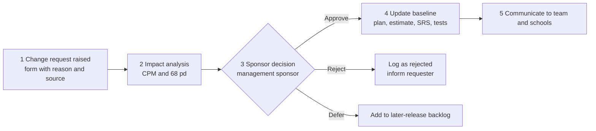

# Scope Management — SchoolDiary (Case 111)

## 1. Pilot scope statement

The pilot delivers SchoolDiary to **2 schools with 2,300 parents and about 107 teachers**. It includes all 8 work items (FR-01 to FR-10): notices with read receipts, homework, attendance alerts, fee reminders, two-way messaging with the 07:00–19:59 teacher sending window and principal-approved urgent exceptions, an admin panel, testing and training. It ships as an **Android app plus a web admin panel with an English UI**. Success targets: 2,070 monthly-active parents (90% of 2,300) and zero routine teacher messages delivered after 20:00. Effort is 68 person-days over 27 working days (see `03_Project_Plan.md`).

## 2. Scope boundary and effect of each decision

| Item | Boundary | Effect on Time | Effect on Cost | Effect on Quality |
|---|---|---|---|---|
| Notices, read receipts (FR-02, FR-03) | In scope | Item A, 8 d, on the critical path; any slip delays go-live day for day | 8 pd of the 68 | Solves the "parents miss notices" problem; read % gives management a record |
| Homework (FR-04) | In scope | Item B, 10 d, critical; it is the reason the plan is 27 d, not less | 10 pd | Acknowledgement improves parent follow-up; reuse of notice code lowers defects |
| Attendance alerts (FR-05) | In scope | Item C, 6 d, float 2 d, so a small slip is absorbed | 6 pd | 15-minute alert meets a safety need; needs correct rosters |
| Fee reminders (FR-06) | In scope | Item D, 5 d, float 3 d | 5 pd | Reminders only, no payment, so no financial-security testing burden |
| Messaging with time limits (FR-07, FR-08) | In scope | Item E, 12 d, float 6 d; largest item but not critical | 12 pd | Core of the case; the time rule is the highest defect risk, so it gets boundary tests |
| Admin panel (FR-01, FR-09, FR-10) | In scope | Item F, 10 d, float 2 d; M1 at day 10 | 10 pd | Clean rosters and role scoping support privacy (NFR-03) |
| Testing and training (G, H) | In scope | 4 d and 5 d, both critical (the 9 days at the end of the plan) | 12 pd + 5 pd | Testing protects delivery reliability; training drives adoption |
| Android app + web admin, English UI | In scope | One code target keeps 27 d achievable | Avoids a second platform's build cost | Covers Android 8+ phones with 2 GB RAM (NFR-05); English suits the pilot schools |
| Remaining 10 schools (11,700 parents) | Later release | None on the pilot; adds rollout time later | No pilot cost; scale and support cost later | Pilot results are used to fix defects before scaling |
| C-01 Multilingual (English / Hindi / Marathi) | Later release | Would add translation and layout testing to the pilot, pushing beyond 27 d | Extra translator and test effort | Would help reading level and adoption; delayed to protect the schedule |
| C-02 SMS fallback | Later release | Needs a gateway integration, so it would extend the critical path if added now | Recurring per-SMS charges | Helps parents without smartphones (risk R2); prioritised first for rollout |
| C-03 PTM slot booking | Later release | New module of its own, no room in a 3-person, 27 d plan | Extra build effort | Nice to have; not needed for the stated problems |
| iOS app | Later release | Doubles the mobile build if added | Second platform's development and test cost | Pilot parents are on Android; iOS deferred without hurting pilot quality |
| Online fee payment | Out of scope | Would add a payment integration and security testing, beyond 27 d | Gateway fees, compliance cost | Money handling raises privacy and fraud risk; not requested (reminders only) |
| Video calls | Out of scope | Real-time media is a separate project | High bandwidth and licence cost | Poor on low-end phones and data plans |
| Student logins | Out of scope | Adds a new role and child-safety rules | Extra build and review effort | Child data and consent concerns; parents remain the users |
| WhatsApp integration | Out of scope | API approval and integration delay | Per-message fees | Would let messages bypass the 20:00 rule and the audit record, defeating the aim |

## 3. Scope-change control procedure

1. **Request:** anyone (teacher, school admin, parent rep, developer) submits a change request stating what, why and which FR or work item it touches. Requests are logged in a change log with an ID.
2. **Impact analysis (project manager, within 2 working days):** find the affected tasks in the CPM. If the task is critical (A, B, G, H) the delay equals the added days; if non-critical, compare with its float (C 2 d, D 3 d, E 6 d, F 2 d). Add the extra person-days to the 68 and recompute the utilisation and the 27-day finish. Also state the effect on quality and on the risk register.
3. **Approval:** the **management sponsor** decides approve, reject or defer. A change that adds more than the available float, or more than the ±20% range (81.6 pd), also needs a fresh estimate first.
4. **Baseline update:** the plan, the Estimation Sheet, the SRS and the test cases are updated and re-issued with a new version number. Only then does the team work on the change.
5. **Communicate:** the decision and new dates go to the team and both pilot schools.

## 4. Scope-creep examples that were rejected

| # | Request (raised by) | Impact analysis | Decision |
|---|---|---|---|
| 1 | Online fee payment in the app (school accounts staff) | Payment gateway, refunds and security tests; touches D and G on the critical chain, more than 5 pd; not one of FR-01–FR-10 | Rejected: out of scope; reminders only |
| 2 | Let parents message any teacher at any hour and have it shown immediately (parent group) | Breaks the 07:00–19:59 rule and the zero after-8 p.m. target; parents may already send anytime and receive an auto-reply | Rejected: conflicts with the objective; auto-reply keeps parents informed |
| 3 | WhatsApp group bridge for teachers (a teacher) | Bypasses time limits and the audit log; API approval delay | Rejected: out of scope |
| 4 | Hindi and Marathi screens before the pilot (a school head) | Translation and layout testing added to the critical chain | Deferred: C-01 in later release |
| 5 | Student logins for homework (a teacher) | New role, new privacy rules, extra tests | Rejected: out of scope |
