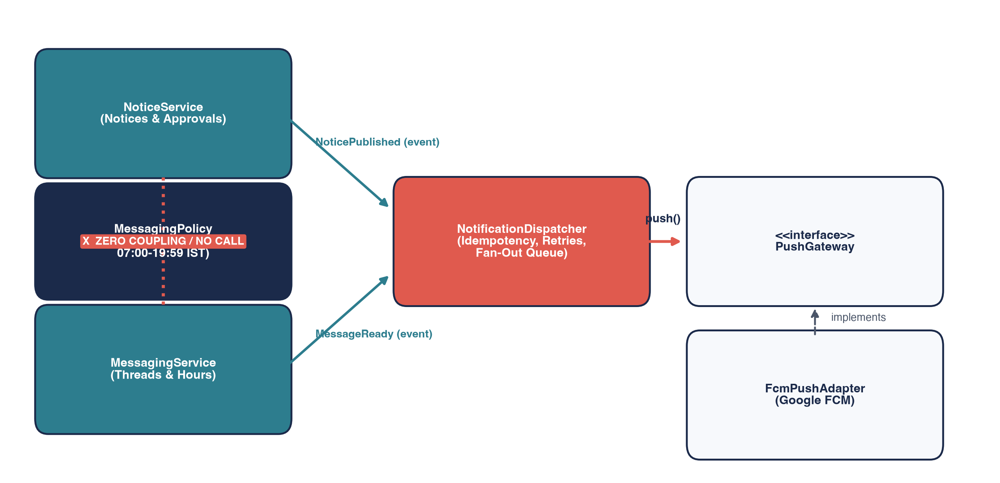
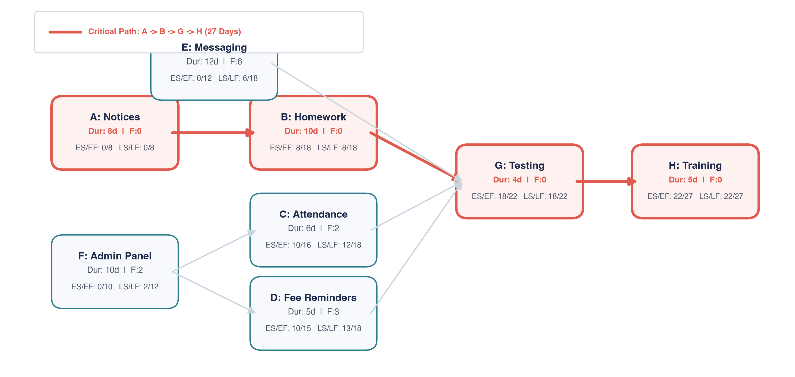
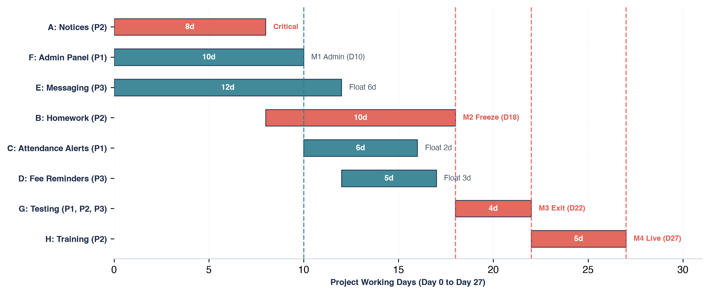
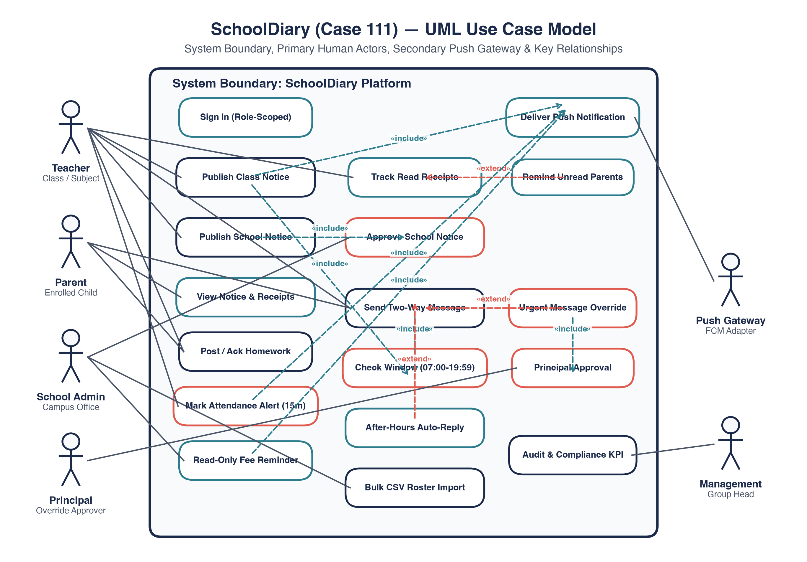
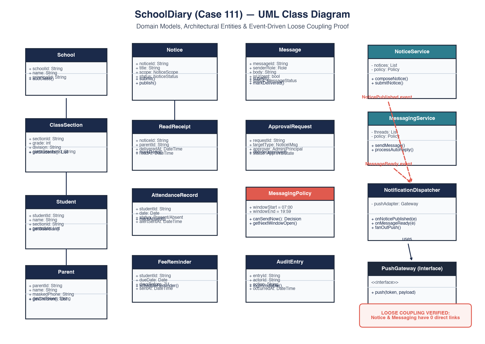
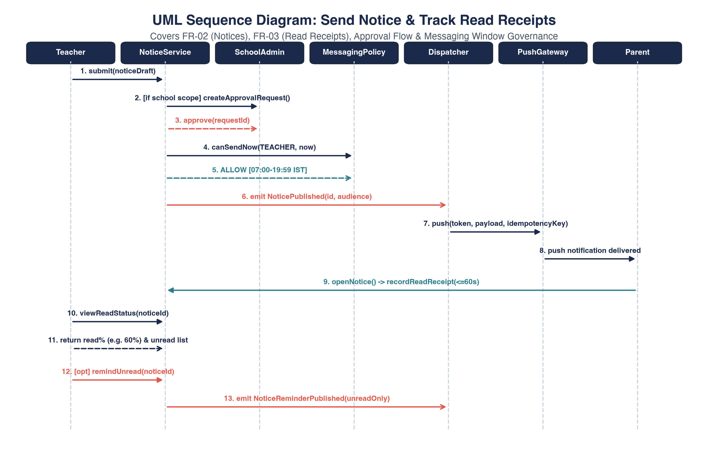
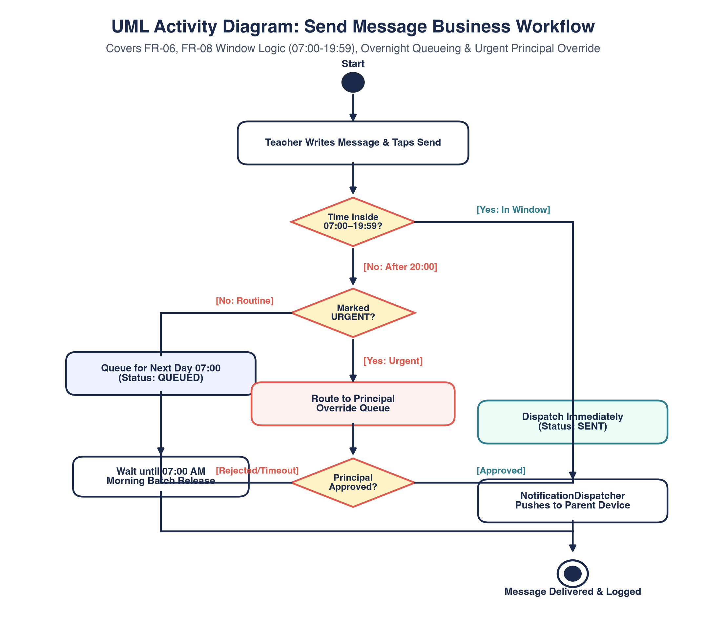
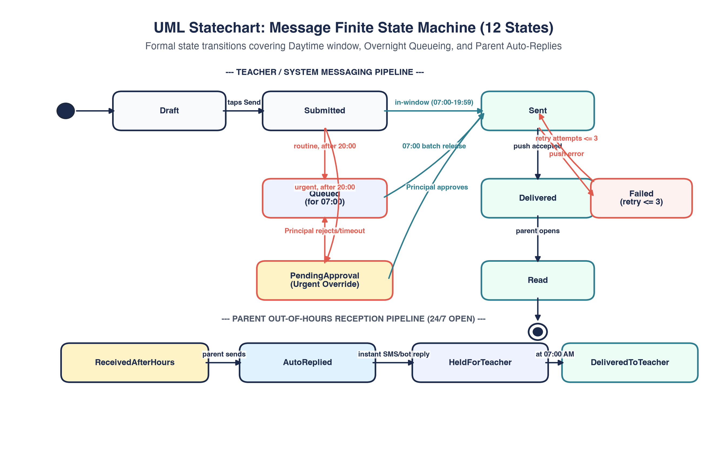

<div align="center">

# 🏫 SchoolDiary
### *Enterprise Parent–Teacher Communication Platform for School Networks*
**Case Study #111 · Software Engineering & Project Management (SE&PM)**  
**B.Tech Computer Science & Engineering (2025–2029) · Semester III**

[](tests/)
[](SchoolDiary_Case111_Full_Report.pdf)
[](01_SRS_and_Priorities.md)
[](06_Test_Plan_and_Evidence.md)
[](app.py)

<br/>

**[📄 Read PDF Report](SchoolDiary_Case111_Full_Report.pdf)** • **[🎯 Viva & Defense Guide](VIVA_AND_PRESENTATION_GUIDE.md)** • **[🚀 Run Web App](#-interactive-working-product-apppy)** • **[🧪 Run Test Suite](#-automated-testing--verification)** • **[📂 Deliverables Index](#-deliverables-index)**

---

</div>

## 📌 Executive Overview & Problem Context

A consortium of **12 schools** communicating with **14,000 parents** and **650 teachers** faced three systemic breakdowns across legacy paper diaries and unmonitored WhatsApp groups:

```
┌─────────────────────────────────────────────────────────────────────────────────────────────────┐
│                                   THE 3 SYSTEMIC BREAKDOWNS                                     │
├───────────────────────────────┬─────────────────────────────────┬───────────────────────────────┤
│    1. The Paper Disaster      │     2. The WhatsApp Chaos       │   3. The Management Blindspot │
│  Circulars and paper diaries  │ Personal phone numbers exposed. │ No centralized legal audit    │
│  get lost or torn in school   │ Intrusive messages at 11:00 PM  │ trail of what was sent, when  │
│  bags. Parents miss notices.  │ cause severe teacher fatigue.   │ it was read, or attendance.   │
└───────────────────────────────┴─────────────────────────────────┴───────────────────────────────┘
```

**The Engineered Solution:**  
**SchoolDiary** centralizes communication across an Android mobile application and web administration portal. It enforces tamper-evident **digital circulars with read receipts**, **15-minute emergency absence alerts**, **read-only fee reminders** (zero payment fraud liability), and an automated **07:00–19:59 IST messaging oracle** reducing after-hours teacher messages to **zero**.

---

## 📊 Project Baseline Data & Mathematical Derivations

All metrics are derived strictly from the case brief and calculated via formal engineering equations:

| Engineering Parameter | Exact Value | Formula / Mathematical Derivation |
|---|:---:|---|
| **Total Institutional Cohort** | `14,000 Parents` | Total parent base across all 12 institutions |
| **Faculty Population** | `650 Teachers` | Total certified faculty members across the network |
| **Pilot Institutional Scope** | `2 Schools` | St. Mary's High School & Delhi Public Academy |
| **Pilot Parent Cohort** | `2,300 Parents` | Given pilot parent boundary |
| **Pilot Share of Total Parents** | **`16.43%`** (≈ `16.4%`) | $\frac{2,300}{14,000} \times 100 = 16.42857\dots\%$ |
| **Proportional Pilot Faculty** | **`~107 Teachers`** | $650 \times 16.42857\% = 106.78 \approx 107\text{ teachers}$ |
| **Total Bottom-Up Effort** | **`68 Person-Days`** | Notices(8) + HW(10) + Att(6) + Fee(5) + Msg(12) + Admin(10) + QA(12) + Train(5) |
| **Engineering Team Size** | `3 Developers` | Dev P1 (Lead Architect), Dev P2 (Frontend/Training), Dev P3 (Backend/QA) |
| **Ideal Theoretical Duration** | **`23 Working Days`** | $\frac{68\text{ person-days}}{3\text{ devs}} = 22.67 \approx 23\text{ days}$ (assumes 100% unconstrained parallelism) |
| **Scheduled CPM Duration** | **`27 Working Days`** | Critical Path: Task A (8d) $\rightarrow$ Task B (10d) $\rightarrow$ Task G (4d) $\rightarrow$ Task H (5d) |
| **Capacity & Utilisation Rate** | **`83.95%`** (≈ `84%`) | Total capacity: $3 \times 27 = 81\text{ pd}$; Utilisation: $\frac{68}{81} \times 100 = 83.95\%$ |
| **Schedule Precedence Stretch** | **`4 Working Days`** | $27\text{ scheduled days} - 23\text{ ideal days} = 4\text{ days}$ (Task dependencies & single trainer) |
| **Monthly Active Parent Target**| `90%` | Pilot Target: $2,300 \times 90\% = \mathbf{2,070\text{ parents}}$; Group: $12,600\text{ parents}$ |
| **Late Message Curfew SLA** | **`0 Messages`** | Routine faculty notifications delivered after 20:00 IST reduced to zero |
| **Pre-Release Defects ($E$)** | `34 Defects` | Discovered across design reviews (7), unit (11), integration (7), system (6), UAT (3) |
| **Post-Release Defects ($D$)** | `2 Defects` | Week 1 midnight queue bug (`DEF-35`) + Week 2 date rendering bug (`DEF-36`) |
| **Defect Removal Efficiency (DRE)**| **`94.4%`** | $\text{DRE} = \frac{E}{E + D} = \frac{34}{34 + 2} = \frac{34}{36} = \mathbf{94.44\%}$ (Target: $\ge 90\%$) |
| **System Defect Density** | **`4.00 / KLOC`** | $36\text{ total defects} \div 9.0\text{ KLOC total codebase}$ |
| **Highest Density Subsystem** | **`5.45 / KLOC`** | Messaging Subsystem ($12\text{ defects} \div 2.2\text{ KLOC}$; 36% above system average) |

---

## 🏛️ System Architecture & Visual Design Package

### 1. Decoupled Event-Driven Domain Architecture
`NoticeService` and `MessagingService` have **zero direct method calls, zero shared interfaces, and zero cross-module database foreign keys**:

<div align="center">
  
  <p><i>Figure 1: Event-Driven Domain Architecture — Complete Decoupling via Shared NotificationDispatcher Bus.</i></p>
</div>

* **Asynchronous Integration:** `NoticeService` emits `NoticePublished`; `MessagingService` emits `MessageReady`. An independent `NotificationDispatcher` handles device push tokens, idempotency keys, and exponential retry backoffs.
* **Pure Policy Engine:** Both modules query a stateless rules engine (`MessagingPolicy`) for 07:00–19:59 IST window evaluations.

---

### 2. Critical Path Method (CPM) & Project Schedule
Why does a 68 person-day project with 3 engineers take **27 days** instead of **23 days**?

<div align="center">
  
  <p><i>Figure 2: Critical Path Network Diagram — Highlighting Critical Chain A(8d) → B(10d) → G(4d) → H(5d) = 27 Days.</i></p>
</div>

1. **Precedence Dependency ($A \rightarrow B$):** Task B (Homework, 10d) reuses notice distribution code from Task A (Notices, 8d), pushing completion to **Day 18**.
2. **Feature Freeze Gate ($B \rightarrow G$):** Task G (System Testing, 12 person-days $\div$ 3 devs = 4 calendar days) requires all functional modules code-complete.
3. **Single Trainer Constraint ($G \rightarrow H$):** Task H (School Training, 5 days across 2 campuses) is delivered in person by a single developer (P2) and cannot be divided.
4. **Schedule Stretch:** The 4-day gap ($27 - 23$) reflects structural dependencies, achieving a safe, sustainable **84% team utilization**.

<div align="center">
  
  <p><i>Figure 3: Project Schedule Gantt Chart with Resource Allocation & Milestones M1–M4.</i></p>
</div>

---

### 3. Formal UML Design Models

The system architecture is formally modeled using standard UML 2.5 diagrams in [`02_UML_Design.md`](02_UML_Design.md):

<details>
<summary><b>🔍 Click to Expand: UML Diagrams Gallery (Use Case, Class, Sequence, Activity, Statechart)</b></summary>
<br/>

#### A. UML Use Case Model
<div align="center">
  
  <p><i>Figure 4.1: UML Use Case Diagram — System Boundary, Actors, Include & Extend Relationships.</i></p>
</div>

#### B. Domain Class Diagram (With Loose Coupling Proof)
<div align="center">
  
  <p><i>Figure 4.2: Domain Class Diagram — Entities, Attributes, Methods, and Decoupled Dispatcher.</i></p>
</div>

#### C. Sequence Diagram: Send Notice & Track Read Receipts
<div align="center">
  
  <p><i>Figure 4.3: UML Sequence Diagram — Notice Publishing, Admin Approval Frame, Time Check & Receipt Tracking.</i></p>
</div>

#### D. Activity Diagram: Teacher Sends a Message
<div align="center">
  
  <p><i>Figure 4.4: UML Activity Diagram — Time Window Decision, Routine Queueing, and Urgent Principal Override.</i></p>
</div>

#### E. Statechart Diagram: 12-State Message Lifecycle
<div align="center">
  
  <p><i>Figure 4.5: UML Statechart — Message Finite State Machine Across Daytime and Overnight Pipelines.</i></p>
</div>

</details>

---

## ⏰ The 07:00–19:59 IST Messaging Rules Engine

The core operational innovation is an automated rules engine governing communication hours:

| Message Timing | Message Type | System Behavior & Lifecycle State |
|---|---|---|
| **07:00 – 19:59 IST** | Routine or Urgent | **Delivered immediately** (`SENT` $\rightarrow$ `DELIVERED`). |
| **19:59 IST** | Last Valid Minute | **Delivered immediately** (*Boundary test `TC-BVA-05` caught defect `DEF-15`*). |
| **20:00 – 06:59 IST** | Teacher Routine | **Blocked & Queued** for next school day 07:00 AM release (`QUEUED`). Zero buzz on parent device. |
| **20:00 – 06:59 IST** | Teacher Urgent | Routes to **Principal Override Queue** (`PENDING_APPROVAL`). If approved $\rightarrow$ sent immediately; if rejected/timeout $\rightarrow$ queued for 07:00 AM. |
| **24/7 (Any Time)** | Parent Message | Parent can submit 24/7. Overnight messages held as `HELD_FOR_TEACHER` with an **instant auto-reply**: *"Teachers reply between 07:00 and 20:00. Call office for emergencies."* Released to teacher inbox at 07:00 AM. |

---

## 📂 Deliverables Index & Artifact Map

This repository contains complete, publication-grade engineering artifacts covering every stage of the Software Development Life Cycle:

| Deliverable ID | Document / Artifact | Scope & Key Contents |
|:---:|---|---|
| **01** | [`01_SRS_and_Priorities.md`](01_SRS_and_Priorities.md) | **IEEE 830 SRS:** 10 Functional Requirements (FR-01 to 10), 6 measurable NFRs, MoSCoW prioritization, and complete Requirements Traceability Matrix (RTM). |
| **02** | [`02_UML_Design.md`](02_UML_Design.md) | **UML Design Package:** Use Case, Class, Sequence (*Send notice & read receipts*), Activity, and 12-state Message statechart with loose coupling justification. |
| **03** | [`03_Project_Plan.md`](03_Project_Plan.md) | **Project Plan:** WBS, CPM Network Diagram, Forward/Backward pass table, Float analysis, Gantt chart, milestones M1–M4, and resource allocation. |
| **04** | [`04_Estimation_Sheet.md`](04_Estimation_Sheet.md) | **Estimation Sheet:** Bottom-up formula working for 68 person-days, 23d ideal vs 27d scheduled duration, 84% utilisation, and "Estimate vs Promise" treatise. |
| **05** | [`05_Scope_Management.md`](05_Scope_Management.md) | **Scope Management:** Pilot scope vs Phase 2 rollout, 16-row In/Out-of-Scope boundary impact table (Time, Cost, Quality), and 5-step Change Control Procedure. |
| **06** | [`06_Test_Plan_and_Evidence.md`](06_Test_Plan_and_Evidence.md) | **Test Plan & Evidence:** System acceptance tests (TC-01 to 10), 18 Boundary Value tests, 13 Decision Table rules, defect log, 4.0/KLOC density, and 94.4% DRE proof. |
| **07** | [`07_Risk_Register_and_Issue_Log.md`](07_Risk_Register_and_Issue_Log.md) | **Risk Management:** 5×5 Probability-Impact heatmap, 8 exposure-ranked risks, RMMM plans for top 3 risks, and separate Issue Log (I-01 to I-03). |
| **08** | [`08_Closure_and_Lessons_Learned.md`](08_Closure_and_Lessons_Learned.md) | **Closure & Retrospective:** Pilot actuals (86.0% adoption, 0 late messages), conditional rollout decision with SMS fallback, and 6 lessons learned. |
| **VIVA** | [`VIVA_AND_PRESENTATION_GUIDE.md`](VIVA_AND_PRESENTATION_GUIDE.md) | **Viva Defense Guide:** 60-second elevator pitch, numerical cheat sheet, top 15 examiner questions with knockout model answers. |
| **REPORT**| [`SchoolDiary_Case111_Full_Report.pdf`](SchoolDiary_Case111_Full_Report.pdf) | **29-Page PDF Report:** Formal executive document with two-pass dynamic Table of Contents and embedded 300-DPI vector diagrams. |

---

## 💻 Interactive Working Product (`app.py`)

The project includes an end-to-end, runnable web application built with **Streamlit** implementing all 10 Functional Requirements (FR-01 to FR-10) with clean brutalist styling:

```bash
# 1. Install dependencies
pip3 install -r requirements.txt

# 2. Launch the interactive application
streamlit run app.py
```

*Live Local URL:* **`http://localhost:8502`**

### Key Application Features:
1. **Interactive Clock Simulator Toolbar:** Toggle between Real Time and Mock Clock (Hour/Minute slider) to test 07:00, 19:59, 20:00, 23:59, and midnight rollover live!
2. **5 Scoped Role Portals:**
   - 👨‍👩‍👧 **Parent Portal (Meena Kulkarni):** Notice board with read receipt capture, homework viewer with "Acknowledge" button, 15-minute absence alert tray, fee reminders (without payment button), and isolated two-way teacher chat with **contextual teacher auto-replies**.
   - 👩‍🏫 **Teacher Portal (Rahul Deshmukh):** Morning roll call with 15-minute absence dispatch, notice composer, live read receipts analytics, and parent threads with urgency overrides.
   - 🏫 **School Admin Portal (Sunita Rao):** School notice approval queue (Approve / Reject), and bulk CSV roster import with row-by-row syntax validation and error reporter.
   - 🎓 **Principal Portal (Dr. Anil Menon):** Emergency out-of-hours message override queue (Rules R3/R4/R5).
   - 📊 **Management & Audit Portal (Group Director):** Real-time compliance gauges (Monthly Active Parents vs 90% target, Late Messages vs 0 target), and searchable communication audit log.

---

## 🧪 Automated Testing & Verification

The system is validated by an automated unit and integration test suite in Python:

```bash
# Run all 41 test cases (BVA, Decision Tables, and Acceptance Tests)
python3 -m unittest discover tests
```

```
.........................................
----------------------------------------------------------------------
Ran 41 tests in 0.003s

OK
```

* **Boundary Coverage:** Evaluates all 18 BVA cases (`TC-BVA-01` to `18`), catching off-by-one (`DEF-15`) and midnight rollover (`DEF-35`).
* **Rule Engine Coverage:** Asserts all 13 Decision Table permutations (`TC-DT-R1` to `R13`).
* **Acceptance Coverage:** Executes all 10 System Acceptance Tests (`TC-01` to `TC-10`).

---

## 🛠️ Artifact Regeneration

To regenerate all diagrams or compile the 29-page PDF report:

```bash
# Generate all 10 high-resolution 300-DPI vector diagrams
python3 generate_diagrams.py

# Compile the 29-page publication-grade PDF report
python3 generate_pdf.py
```

---

## 👤 Author & Academic Integrity

* **Sole Candidate Author:** **Kishan Ojha** ([@Kishann911](https://github.com/Kishann911))
* **Email:** `kishanojha462@gmail.com`
* **Academic Institution:** B.Tech Computer Science & Engineering (2025–2029), Semester III
* **Course:** Software Engineering & Project Management (SE&PM)
* **All Rights Reserved · Academic Capstone Repository**
